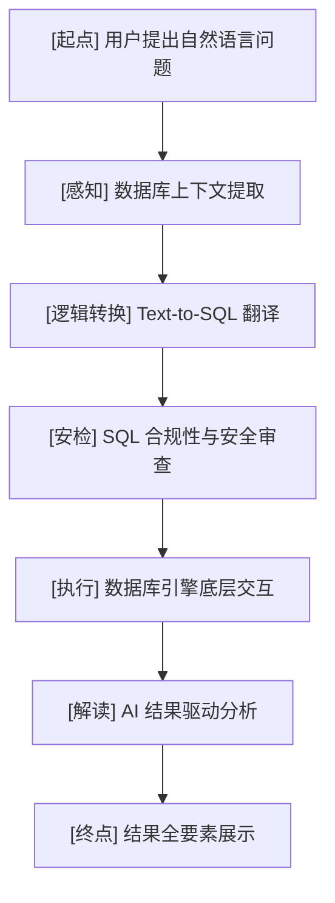

# 智能问数系统逻辑流程图与技术要点

## 1. 核心运行全链路 (架构视角)

## 2. 深度技术要点剖析

### 一、 感知阶段 (Database Perception) - `src/database/schema.py`
这是系统“理解力”的来源。AI 并没有魔法，它必须基于我们构造的“事实”进行推理。
*   **结构解析**：不仅仅是表名，还包括字段类型（Type）和外键关联（FK）。
*   **真实样例 (Sample Rows)**：这是本项目最关键的优化点。通过展示真实数据（如 `status=1` 代表已完成），解决了 AI 无法通过列名猜测字段取值含意的难题。

### 二、 逻辑阶段 (Intelligence Logic) - `src/llm/`
*   **双模型兼容**：支持 Claude (原生 SDK) 与 Qwen (OpenAI 兼容接口) 的切换，并共享同一套注入逻辑。
*   **Prompt 工程**：在 `prompts.py` 中预置了大量领域知识：包含“单查询约束”、“元数据查询方法”、“复合问题解题思路”等，减少了 AI 瞎猜的概率。

### 三、 交互与观测 (Interface & Observation)
*   **交互优化**：采用 `prompt-toolkit` 解决终端输入中文字符重绘时的残留问题，增强删除与光标移动体验。
*   **全链日志 (`logs/`)**：实时记录发给 AI 的**完整 Prompt** 和 **API 原始回复**。这非常有教育意义，你可以通过日志看清模型是如何“思考”并转换逻辑的。

## 3. 学习进阶建议
1.  **摸清脉络**：优先阅读 `src/core/asker.py` 里的 `ask()` 函数，看它如何调度各个子模块。
2.  **实验逻辑**：修改 `src/llm/prompts.py` 里的 `EXAMPLES`，看看对特定提问的生成的准确性是否有提升。
3.  **安全加固**：查看 `src/sql/validator.py`，理解我们是如何在应用层拦截潜在数据库攻击风险的。
